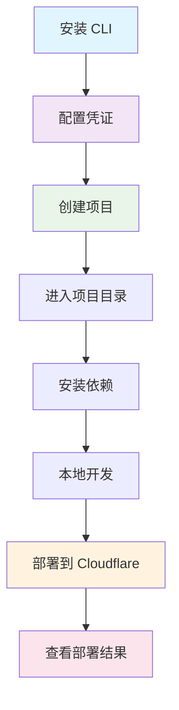

# Router v7 CLI 使用流程

## 🎯 完整使用流程



## 📝 详细步骤

### 1️⃣ 初始设置
```bash
# 安装 CLI
npm install -g router-v7-cli

# 配置 Cloudflare 凭证
router-cli config
# 输入 API Token，Account ID 会自动检测
```

### 2️⃣ 创建项目
```bash
# 创建新项目
router-cli create-project

# 选择配置：
# - 项目名称: my-api-app
# - 模板: api (推荐)
```

### 3️⃣ 开发部署
```bash
# 进入项目目录
cd my-api-app

# 设置本地开发环境变量
cp .dev.vars.example .dev.vars
# 编辑 .dev.vars 文件，填入本地开发变量

# 安装依赖
npm install

# 本地开发（可选）
npm run dev

# 部署到生产环境
router-cli deploy

# 部署到测试环境
router-cli deploy --env staging
```

### 4️⃣ 管理项目
```bash
# 查看所有部署的项目
router-cli list-all

# 重新部署项目
router-cli deploy my-api-app
```

## 🚀 快速命令参考

| 命令 | 说明 | 示例 |
|------|------|------|
| `router-cli config` | 配置凭证 | `router-cli config` |
| `router-cli create-project` | 创建项目 | `router-cli create-project` |
| `router-cli deploy` | 部署项目 | `router-cli deploy my-app` |
| `router-cli list-all` | 查看项目 | `router-cli list-all` |

## 🌐 部署后的访问

项目部署成功后，可以通过以下 URL 访问：

```
生产环境: https://my-api-app.keepwatch.workers.dev
测试环境: https://my-api-app-staging.keepwatch.workers.dev
```

**默认端点：**
- `GET /` - 欢迎页面
- `GET /health` - 健康检查  
- `GET /api/hello` - API 示例

## 🔧 开发提示

### 添加新路由
```typescript
// src/routes/users.ts
import { router } from '../router';

router.get('/api/users', () => {
  return new Response(JSON.stringify([
    { id: 1, name: 'John' },
    { id: 2, name: 'Jane' }
  ]), {
    headers: { 'Content-Type': 'application/json' }
  });
});
```

### 环境变量配置

#### 本地开发变量 (.dev.vars)
```bash
# 复制模板文件
cp .dev.vars.example .dev.vars

# 编辑 .dev.vars 文件
NODE_ENV=development
API_KEY=your-dev-key
```

#### 多环境配置 (wrangler.jsonc)
```json
{
  "env": {
    "production": {
      "vars": {
        "NODE_ENV": "production",
        "API_KEY": "your-prod-key"
      }
    },
    "staging": {
      "vars": {
        "NODE_ENV": "staging", 
        "API_KEY": "your-staging-key"
      }
    },
    "local": {
      "vars": {
        "NODE_ENV": "local",
        "API_KEY": "your-local-key"
      }
    }
  }
}
```

## 🚨 常见问题

1. **部署失败** → 检查 `wrangler.jsonc` 是否存在
2. **URL 无法访问** → 运行 `router-cli list-all` 查看状态
3. **权限错误** → 重新运行 `router-cli config`
4. **依赖问题** → 运行 `npm install`

## 📞 获取帮助

```bash
# 查看所有命令
router-cli --help

# 查看特定命令帮助
router-cli deploy --help
```

---

**Router v7 CLI** - 让 Cloudflare Workers 开发更简单！ 🚀 